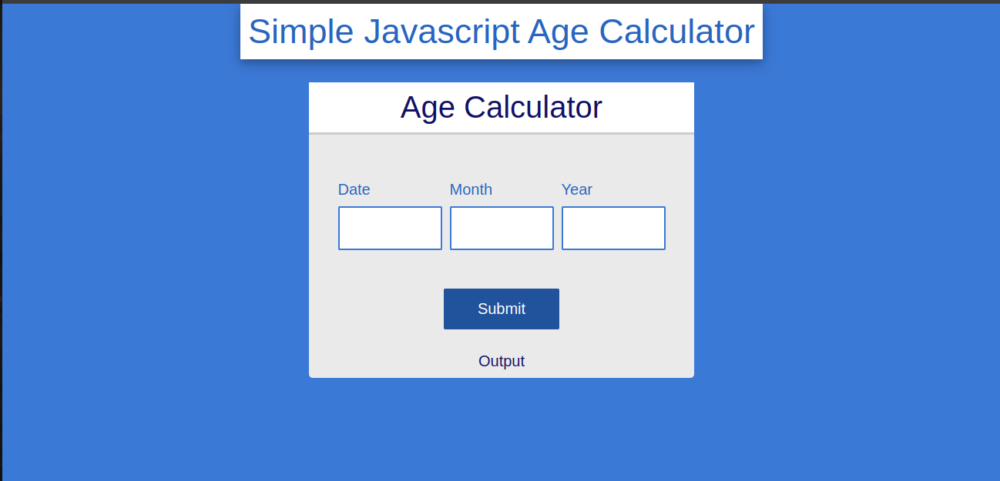

# Simple Calculator using HTML, CSS and JAVASCRIPT

This simple project shows a simple calculator that counts the age, month and days using javascript.

## Author
**Chance KARAMBIZI**
## Screen Shot of Output

**Home Page**

## Usage
### Steps
 1. Clone Repository
  
        git clone https://github.com/MihNan/calculator_with_javascript.git

 2. Step Two

    open calculator_with_javascript Folder in your downloads folder

3. Step Three

    open index.html in your browser

## License
        [MIT License](LICENSE)

Feel Free to create Folks and don't hesitate to reach if encounter an issue or follow up idea.

### Contact Me
        Email: karambizi2chance@gmail.com
        Phone: +250788991010

## Have Fun !!